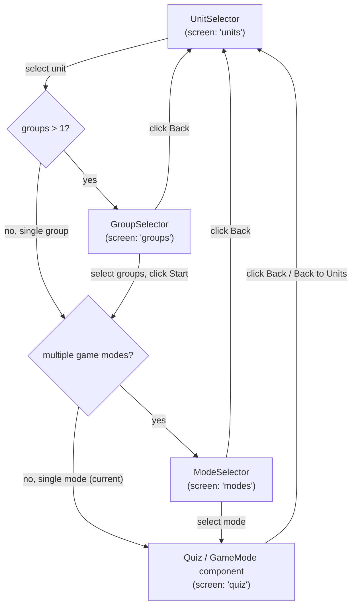

# Word Learner

## Project Info
- **Repository**: git@github.com:antusus/word-learner.git
- **GitHub Pages URL**: https://antusus.github.io/word-learner/

## App Flow



**Key rules:**
- Multi-group unit (groups > 1) -- show `GroupSelector` for the user to pick groups
- Single-group unit (groups = 1) -- skip `GroupSelector`, use all words
- Multiple game modes -- show `ModeSelector`
- Single game mode (current state) -- skip `ModeSelector`, go straight to quiz

## Adding New Units

Each unit needs a `words.json` file in `src/data/UnitName/`:

```json
{
  "title": "Unit 5 - My words",
  "groups": [
    {
      "name": "Animals",
      "words": [
        { "en": "alpaca", "pl": "alpaka" },
        { "en": "capybara", "pl": "kapibara" }
      ]
    },
    {
      "name": "Adjectives to describe animals",
      "words": [
        { "en": "beautiful", "pl": "piękny" },
        { "en": "cute", "pl": "uroczy" }
      ]
    }
  ]
}
```

Units are auto-discovered at build time. Words within a unit are organized into named groups.

## Data Types

```typescript
// src/types/index.ts
export interface WordGroup {
  name: string;
  words: Word[];
}

export interface WordsFile {
  title: string;
  groups: WordGroup[];
}

export interface Unit {
  id: string;
  title: string;
  words: Word[];       // flattened from all groups
  groups: WordGroup[];  // structured groups
}
```

## Future Enhancements
- [ ] Progress tracking (localStorage persistence for completed units)
- [ ] Fill-in-the-blanks mode
- [ ] Matching game mode
- [ ] PWA offline support
- [ ] Audio pronunciation
- [ ] Spaced repetition
- [ ] E2E tests with Playwright
